# Hom Family
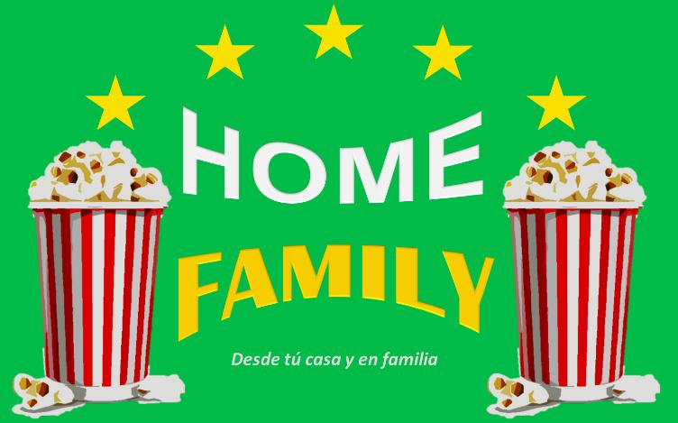

# ¿Que es Hom Family?🤷‍

Hom family es una página pensada y diseñada para toda la familia, donde encontraras información de las películas de tu interes. Que luego podras ver junto a los tuyos.
Esta es una página familiar ,sensilla y comoda, en la que restringimos la emisión de contenido indebido a los menores de edad.Publicámos constantemente nueva información sobre películas para que siempre tengas iformación relevante de las peliculas de tu interes y de tus regalones.
Aqui en hom family cuidamos tu tiempo es por esto que podras buscar las peliculas por su nombre, si no recuerdas su nombre puedes buscar por alguna palabra clave que contenga la pelicula.

# Información sobre el proceso

Luego de leer y comentar los requisitos del proyecto, lo primero que realizamos fue una lista de tareas, ordenadas en base a las prioridades necesarias para cumplir con lo requerido. De acuerdo a nuestra lista de tareas realizada en Trello.
## Planificación📌

[Clic aquí para ver planificación](https://trello.com/b/R1poAS74/scl009-hackathon-peliculas, ) 

El primer paso fue la realización de un diagrama de flujo.

##  Diagrama de flujo✍🏻

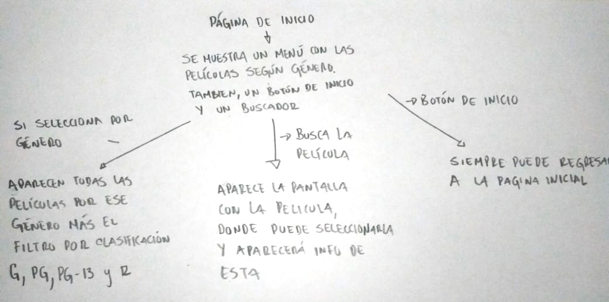

Seguido de esto construimos un prototipo de baja fidelidad usando como referentes algunas páginas de internet.

##  Prototipo de baja fidelidad

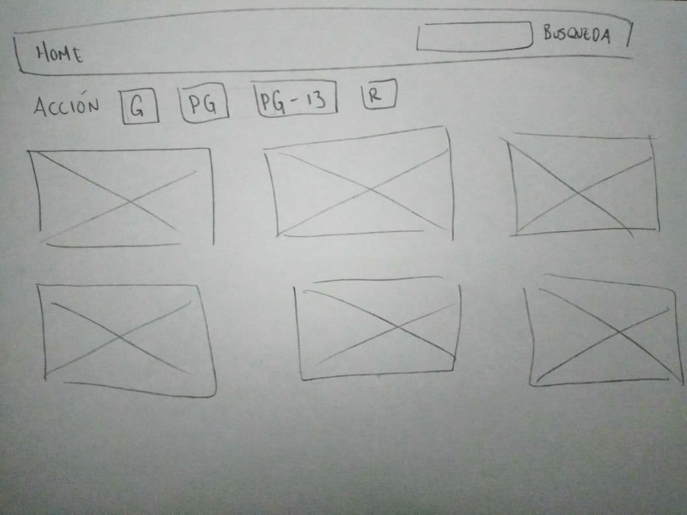

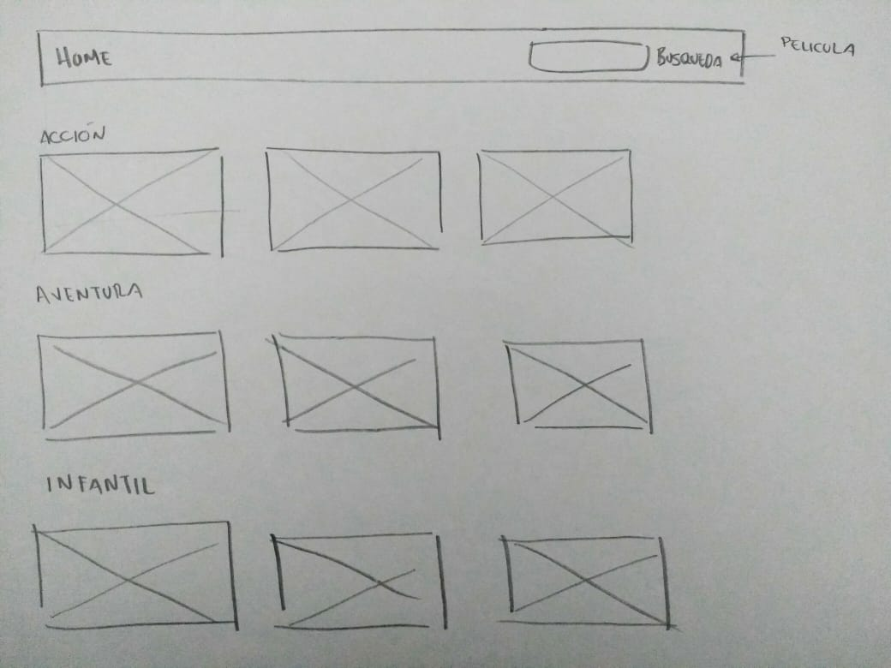

Por otro lado realizamos un prototipo de alta fidelidad en figma que fue nuestra guía para comenzar con la elavoración de la página.

# Prototipo de alta fidelidad

[Clic aquí para ver prototipo de alta fidelidad en figma](https://www.figma.com/proto/0EqsJdLWw5tdcfuQlDYtgb5D/Hackaton1?node-id=6%3A7&scaling=min-zoom)

# Encuesta 📊

Además realizamos una encuesta en línea para informarnos de los aspectos que debería considerar nuestra página. La encuesta reflejó que los usuarios principalmente ven películas junto a todo su nucleo familiar.Por lo mismo les es útil una página, que los mantenga informados sobre este tipo de películas,Además hacen sus busquedas mayoritariamente por nombre de pelicula y genero. La encuesta tambien arrojo que cuando no conocen la película lo que más les interesa es la sinopsis. 

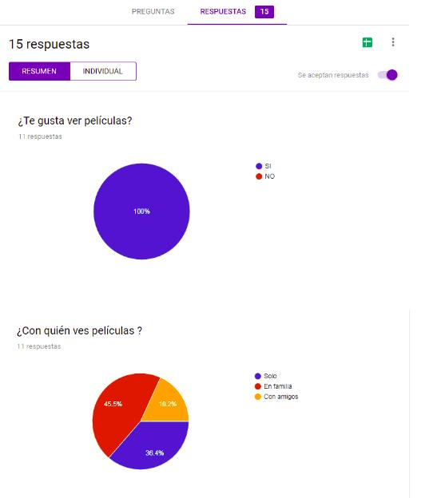

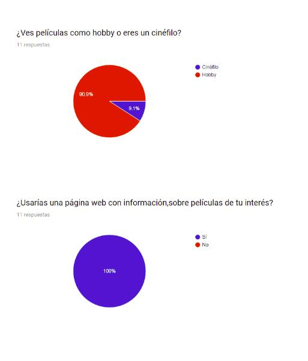

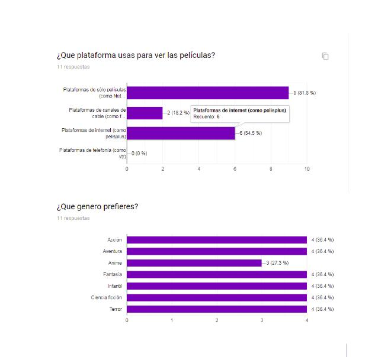

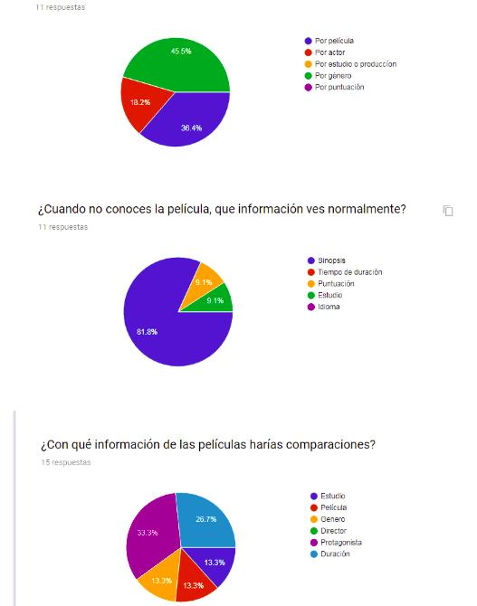

# Historias de usuario👩‍💼👩‍  👩‍👨‍🙎‍

## Historia de usuario 1

YO COMO padre QUIERO poder filtar las películas según su genero PARA decidir si es de mi interés verla o no.

## Historia de usuario 2

YO COMO usuario QUIERO poder filtrar las películas según su clasificación PARA saber si mis hijos deben verla o no bajo mi supervisión.

## Historia de usuario 3

YO COMO usuario QUIERO obtener información de las películas PARA poder decidir si deseo verla.

## Historia de usuario 4

YO COMO usuario QUIERO poder buscar las películas por su nombre PARA saber si se encuentra o no dentro de la plataforma.

## Historia de usuario 5

YO COMO usuario QUIERO un botón que me lleve a la pantalla de inicio PARA siempre poder regresar al menú inicial cuando desee

# Objetivos de la aplicación💻

- Entrar a la plataforma directamente sin necesidad de loguearse o ingresar datos personales .

- Buscar las películas por su nombre.

- Filtar las películas según su genero.

- Filtrar las películas según su clasificación.

- Siempre poder regresar al menú inicial cuando desee ṕor medio de un boton.

- Econtrar información relevante de cada pelicula.

- Filtro por clasificación.

# Testeos de usabilidad con prototipo de alta fidelidad.
A continuación veras imágenes de nuestro prototipo de alta fidelidad,que fue creado en figma. Con el que realizamos nuestro primer testeo para construir las historias de usuario.

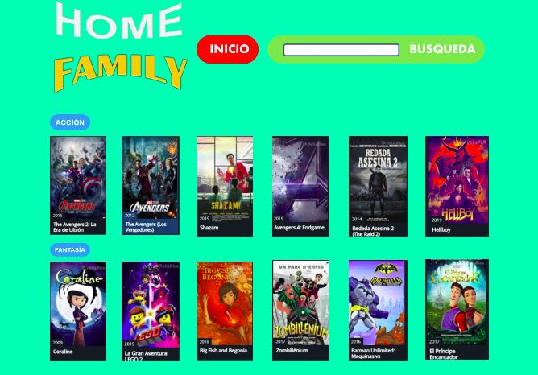

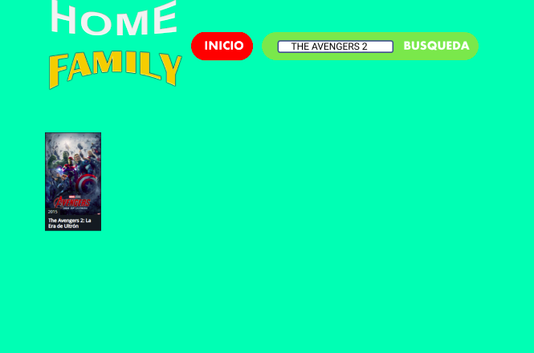

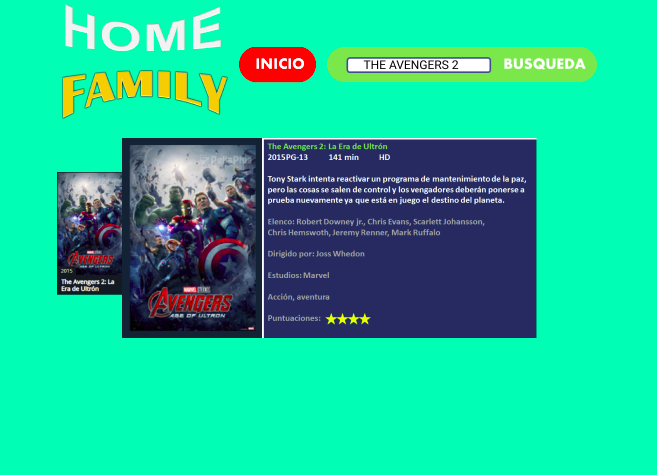

### A continuación comentarios de los usuarios y video de nuestro test de usabilidad con los cuales comenzamos a realizar nuestras historias de usuario y los comentarios de los mismos.📷

Observación Usuario -[Vicente 19 naños](https://www.youtube.com/watch?v=phIY7e4s1jA): EVstudiante universitario, suele ver películas en Internet-: se pide buscar película por nombre intuye que debe escribir el nombre y presionar buscar,cuando se pide buscar más información sobre la película el usuario entiende que debe presionar sobre la película .cuando se le pide ver solo películas de acción le queda claro que debe seleccionar categoría acción,comentarios del usuario que cada símbolo de restricción por edad contenga explicación.

Observación Usuario- [Alonso 9 años](https://www.youtube.com/watch?v=t-jLsQs-HYc)-: indica que es una pagina de películas,se le pide la tarea de buscar por nombre, aunque demora un poco lo logra. Se le pide más información acerca de la película y se pregunta como lo haría para encontrarla, indica que seleccionaría información sobre la película .No le queda claro que debe hacer clic sobre ella, porque no hay nada que le haga referencia. Comenta que debería decir información debajo de ella para que sea más comprensible. luego se pide volver a pagina principal o inicio aqui comprende que debe seleccionar inicio.

Observación Usuario -
[Claudio 55 años](https://www.youtube.com/watch?v=yb92l4B4jV4): indica que al ver la pagina le habla de una pagina de películas para familia ,se pide buscar una película en particular, intuye que debe escribir nombre en el buscador y seleccionar buscar e indica que entraría en la película haciendo clic sobre ella ,respecto de la clasificación por edad debe tener explicación ya que no todos saben que significa. Al pedir volver al menú principal aunque demora un poco probablemente por la ubicación pero finalmente selecciona inicio para volver a la primera pagina.

Observación Usuario -[Benjamin 16 años](https://www.youtube.com/watch?v=sP5RLjETQQA): Suele buscar paginas con información de películas y paginas para ver películas -:Al ver la pagina indiva ques es para ver peliculas o bien buscar infromacion sobre ellas por el modelo que sigue,se pide la tarea de buscar película se dirige al buscador sin problemas ,luego se solicita buscar más información sobre la película presume que puede hacer clic sobre la imagen ,pero comenta que seria mas intuitivo agregar un comentario o botón que diga mas información. Respecto de las clasificación por edades comenta que cada clasificación debería tener una explicación,dado que, no todos conocen que significa cada una. Ademas se pide regresar a página principal y selecciona inicio intuitivamente ,por otro lado se pide ir a la categoría de acción indica que presionaría acción. sugiere tener todas las categorías juntas en una pestaña llamada genero y luego se puedan desplegar todas las categorías. Finalmente usuario comenta que la aplicación debe tener una explicación que aclare si se mostraran películas o solo se podrá ver información de las mismas.

Observación Usuario -[Rodolfo 17 años](https://www.youtube.com/watch?v=l943UHO0LyI)
 Estudiante de tercero medio. Que suele ver películas en Internet-: se pide buscar película por nombre intuye que debe escribir el nombre y presionar buscar,cuando se pide buscar mas información sobre la película el usuario entiende que debe presionar sobre la película, además le queda claro que el boton de inicio lo devuelve a la paina principal.
 Cuando se le pide ver solo películas de acción le queda claro que debe seleccionar categoría acción,comentarios del usuario que cada símbolo de restricción por edad contenga explicación.

 Observación Usuario -mujer de 28 años-: el fondo y estilo debe ser mas entretenido que llame la atención, le pareció bien la información que ofrece, aunque tuvo dificultad al usarla no intuyó ninguna de las acciones.

# Nuestro producto

[Aqui podras ver nuestra pagína](https://marineslemus007.github.io/SCL009-hackathon-peliculas/src/index.html)

# Consideraciones técnicas

La lógica del proyecto esta implementada completamente en JavaScript, HTML y CSS.

# Herramientas
- Git
- GitHub
- GitHub Pages
- HTML5 
- CSS3
- Vanilla JS
- Node.js
- Mocha
- Bootstrap 4.

# Conclusión 

Si bien luego de testear con el prototipo de alta fidelidad logramos integrar soluciones a nuestra aplicación. Esperamos seguir iterando con la pagína en funcionamiento, para lograr un mejor producto y experiencia de usuario.
 

Estudio realizado por:

Marines Lemus

Gelen Montilla

Dayana Mateluna

